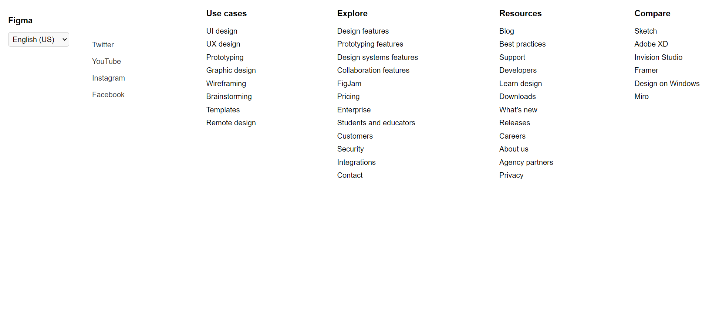

</head>
<body>
    

        <h2>Thông tin sinh viên</h2>
        
<strong>Tên sinh viên:</strong> Nguyễn Hoàng Duy

        
<strong>Mã sinh viên:</strong> BIT230128

        
<strong>Tên bài tập:</strong> Bài tập 03: Sử dụng UL LI và CSS

        
<strong>Ảnh kết quả bài tập:</strong>

    

</body>
</html>

